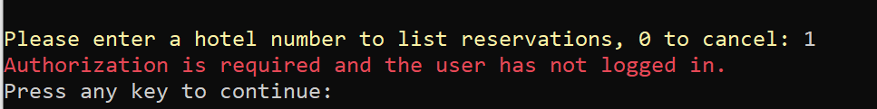
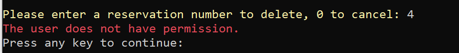

# Authentication - C# Lecture Notes

In this lecture, you'll continue working with the hotel reservation API server and client application. You'll focus on adding authentication and authorization to both.

## Running the application

First, open the `AuthenticationLecture` solution in Visual Studio, and have the students do this with you. The solution contains both the server and client components.

Since both applications are included in the solution, you'll have to configure the solution to run both projects simultaneously. In Visual Studio, right-click the solution and select **Set Startup Projects...** In the window that appears, select "Multiple startup projects" and set both _HotelReservationsServer_ and _HotelReservationsClient_ to have the action "Start." Click the **OK** button.


Both client and server now launch when you click "Start."

## Login endpoint

With the server application running, open Postman and test the login endpoint. Make a `POST` request to `https://localhost:44322/login` and use the following JSON as the request body. Remember to set body type to "Raw" and "JSON":

```json
{
	"username": "test",
	"password": "test"
}
```

Show the students the response received from the request. Your "token" value will be slightly different than the screenshot. The students may also receive different tokens because timestamps are encoded in it:


> Keep the login tab open—you'll reuse it later in the lecture.

Back in Visual Studio, in the server project, open `LoginController.cs` and walk the students through the `Authenticate()` method. This is the method for the login endpoint.

Some things to point out:
- Defaulting to a unsuccessful login
- Hashing the password input and comparing to hash on file. Never store passwords in plain-text.

```csharp
[HttpPost]
public IActionResult Authenticate(LoginUser userParam)
{
    // Default to bad username/password message
    IActionResult result = BadRequest(new { message = "Username or password is incorrect" });

    // Get the user by username
    User user = userDao.GetUser(userParam.Username);

    // If you find a user and the password hash matches
    if (user != null && passwordHasher.VerifyHashMatch(user.PasswordHash, userParam.Password, user.Salt))
    {
        // Create an authentication token
        string token = tokenGenerator.GenerateToken(user.Id, user.Username, user.Role);

        // Create a ReturnUser object to return to the client
        ReturnUser retUser = new ReturnUser() { Id = user.Id, Username = user.Username, Role = user.Role, Token = token };

        // Switch to 200 OK
        result = Ok(retUser);
    }

    return result;
}
```

Point out to the students what you've done so far is "authentication", which is the process of validating that users are who they claim to be. You authenticated with a username and password, but authentication can be in many different forms like fingerprints and personal identification numbers (PINs).

## JWT

Take some time to talk about JSON Web Tokens (JWT). Highlight these points:

- Their compact size allows for quick transfer with requests.
- They're often used as authorization mechanisms, storing user info such as their permissions or roles. These are called "claims."
  - They can contain any data that can be represented in JSON.
- JWT actually contains JSON, but it's encoded.

Copy the token value from the Postman response, open [JWT decoder](https://jwt.io/#debugger-io), and paste in the token on the "Encoded" side. Show the students the payload section in particular:


You'll see claims such as `sub`, `name`, and `role`, which are similar to the "id", "username", and "role" fields from the login response.

There's also `nbf`, `exp`, and `iat`. These are three timestamps:
- `nbf` = "Not valid before"
- `exp` = "Expires"
- `iat` = "Issued At"

Timestamps are stored in "Unix time", which is the number of seconds since `01-01-1970 00:00:00 UTC`. Unix time is preferred because it can be represented by a number, without concern for format or timezones.

You can also show a neat feature of the JWT.io decoder. Hover over any field name—except "name" or "role"—and it shows you what the field name stands for:


If you hover over a Unix timestamp, it shows you the time in a human-readable format, including your timezone:


### Token generator

While students probably won't have to write their own token generator, and there are a lot of freely available ones to copy online, it's still important for them to understand what goes into the token generation.

Open `Security\JwtGenerator.cs` and show the students the `GenerateToken()` method:

Some things to point out:
- The three claims made in the `claims` array:
  - `"sub"` -> Subject. It must a unique value. In this example, it's the user ID.
  - `"name"` -> Username
  - `ClaimTypes.Role` -> Role
- You can pass a `ClaimTypes` value, or just a string, as the first parameter for `Claim()`.
- `IssuedAt` and `Expires` fields are just `DateTime` values. .NET automatically converts these to Unix time.
- .NET also adds the `nbf` (Not Valid Before) field if not defined

```csharp
public string GenerateToken(int userId, string username, string role)
{
    Claim[] claims = new Claim[]
    {
        new Claim("sub", userId.ToString()),
        new Claim("name", username),
        new Claim(ClaimTypes.Role, role),
    };

    SecurityTokenDescriptor tokenDescriptor = new SecurityTokenDescriptor
    {
        Subject = new ClaimsIdentity(claims),
        IssuedAt = DateTime.UtcNow,
        Expires = DateTime.UtcNow.AddDays(7),
        SigningCredentials = new SigningCredentials(new SymmetricSecurityKey(Encoding.ASCII.GetBytes(JwtSecret)), SecurityAlgorithms.HmacSha256Signature),
    };

    JwtSecurityTokenHandler tokenHandler = new JwtSecurityTokenHandler();
    SecurityToken token = tokenHandler.CreateToken(tokenDescriptor);

    return tokenHandler.WriteToken(token);
}
```

## Setting authorization rules

Point out to the students that you'll now set up authorization rules on the server. "Authorization" is the process of giving a user permission to access a specific resource or function. In the next example, the authorization rule is as follows: anyone that's authenticated—meaning they have a valid JWT token—is authorized to access the resource.

Start the server again if it's not already running. Before adding any authorization rules, demo the `/hotels` and `/hotels/{id}` endpoints again in Postman. It should retrieve data like it has before.

Stop the server and open `HotelsController.cs`. Add the `[Authorize]` attribute to the `GetHotel()` method (order doesn't matter):

```csharp
[Authorize]
[HttpGet("{id}")]
public ActionResult<Hotel> GetHotel(int id)
{
    ...
}
```

Start the server again and try to request the `/hotels` and `/hotels/{id}` endpoints again. The `/hotels` method still works, but the `/hotels/{id}` endpoint results in a `401 Unauthorized` response:


Take this moment to explain that because there were no authorization credentials sent, the server responds with a `401` code.

You can use the token you used before, if you want. If not, make another `POST` request to `https://localhost:44322/login` with the test username and password to retrieve a new token.

In Postman, open the "Authorization" tab in the request, change the "Type" drop-down to "Bearer Token", and paste the token in the "Token" field. After you send the request, it returns the data with a `200 OK` response code:


If you want to show there's no trickery, you can switch the "Type" drop-down back to "No Auth" and you'll receive a `401` again.

You may also want to show that the token is passed in the `Authorization` HTTP header by switching to the "Headers" tab:


If you don't see the "Authorization" key, click the "X hidden" text (X is a number) to right of the "Headers" label to reveal all header key-value pairs.

Next, move the `[Authorize]` attribute from the method to the class attributes:

```csharp
[Route("hotels")]
[ApiController]
[Authorize]
public class HotelsController : ControllerBase
{
    ...
}
```

Start the server again and show in Postman that requests to both `/hotels` and `/hotels/{id}` endpoints now require authorization. In fact, all methods in the controller now require authorization.

### Anonymous access

Point out that placing the attribute on the class level is useful if you know that an authorization rule applies to all methods in a class. However, there may be times where you want a class-level rule like that, but you want to override it for a particular method.

Imagine that you want authorization on all methods, except the `/hotels` endpoint. To override the class-level rule and allow anonymous—that is, not authenticated—access to the method, add the `[AllowAnonymous]` attribute to the `ListHotels()` method:

```csharp
[AllowAnonymous]
[HttpGet()]
public List<Hotel> ListHotels()
{
    return hotelDao.List();
}
```

Run the server and return to Postman. In the request to `/hotels`, set the authorization type drop-down to "No Auth." The request now returns data again. Show that adding an id, such as `/hotels/2`, without authorization won't work and returns a `401`.

### Role based authorization

It's not uncommon to have certain resources or functions only be accessible to certain people or roles. In the case of the hotel reservations, perhaps only admins can delete a reservation.

First, show that the endpoints work with the token you've been using. Make a `GET` request to the `/reservations` endpoint:


Then, make a `DELETE` request to `/reservations/{id}` with a valid ID of one of the reservations, such as `/reservations/1`. You'll receive a successful `204 No Content` response:


> You can perform a `GET` request again to show it was deleted. All data resets when you restart the application.

Open `ReservationsController.cs` and find the `DeleteReservation()` method at the bottom of the class. Add the `[Authorize(Roles = "admin")]` attribute to the method:

```csharp
[Authorize(Roles = "admin")]
[HttpDelete("reservations/{id}")]
public ActionResult DeleteReservation(int id)
{
    Reservation existingReservation = _reservationDao.Get(id);
    if (existingReservation == null)
    {
        return NotFound();
    }

    bool result = _reservationDao.Delete(id);
    if (result)
    {
        return NoContent();
    }
    return StatusCode(500); //in case DAO has an error in deleting
}
```

This attribute means only users with the "admin" role can access this resource. Try to perform the same `DELETE` request in Postman, and you'll receive a `403 Forbidden` response:


Take this moment to explain that because the authorization credentials don't have the admin role, they only had the view role. You can refer to the decoded JWT or login response to show that.

Return to the login request tab, and change the credentials to admin/admin:

```json
{
	"username": "admin",
	"password": "admin"
}
```

Send the request and you'll receive a new token:


Copy and paste the new token into the `DELETE` request, and it succeeds again.

## Client code

Now you'll switch over to the client code in the `HotelReservationsClient` project.

> Note: Because you need to call endpoints for authentication as well as hotel and reservation data, `HotelApiService` has been re-factored into a base class, `ApiService`, and two derived classes, `HotelApiService` and `AuthenticationApiService`.

Now, show the students the `Login()` method in `AuthenticationApiService.cs`. It looks like a typical `POST` request:

```csharp
public bool Login(string submittedName, string submittedPass)
{
    LoginUser loginUser = new LoginUser { Username = submittedName, Password = submittedPass };
    RestRequest request = new RestRequest("login");
    request.AddJsonBody(loginUser);
    IRestResponse<ApiUser> response = client.Post<ApiUser>(request);

    CheckForError(response, "Login");
    user.Token = response.Data.Token;

    // TODO: Set the token on the client

    return true;
}

```

The `LoginUser` class has two `string` properties: `Username` and `Password`. This is the data being submitted with the `POST` request.

An `ApiUser` class has been defined, too. This class has properties that match fields returned from the login endpoint, so you can deserialize the response into an object. If `CheckForError()` doesn't throw an exception, the authentication was successful and the token is found in `response.Data.Token`. That token is set to a `private ApiUser` in the `ApiService` class.

You must also set the token on the RestSharp client, so that it's sent in the HTTP headers each time it makes a request. Add the following line between the assignment to `user.Token` and the `return` statement:

```csharp
client.Authenticator = new JwtAuthenticator(user.Token);
```

This sets the `Authorization` HTTP header for all further requests as long as the `client` object isn't destroyed. It's `static` in the `ApiService` class so it's only created once and lasts the duration of the application.

If you run the client application without logging in, all methods except the first one, "List Hotels", won't work, and you'll receive an error:

```
An http error occurred.
```

Select option 6 to login and use test/test as the username and password. Select option 2 and then hotel 2, and you'll now receive the data.

While logged in as "test", attempt to delete a reservation, and you'll receive a `403` response. The error message says `An http error occurred.`. This is because you need to be logged in as an admin.

### Handling 401 and 403 responses

Displaying a status message doesn't create a great user experience—your users won't know what "An http error occurred." means. Since you know what's wrong when you receive a `401` or `403`, you can use this information to display a better message to the user.

In `ApiService.cs`, in the `CheckForError()` method, locate the `else if (!response.IsSuccessful)` block. Right now, the error message that gets thrown says an http error occurred. Modify the block so it checks for `401` and `403` requests, and sets a more appropriate message:

```csharp
else if (!response.IsSuccessful)
{
    if (response.StatusCode == System.Net.HttpStatusCode.Unauthorized)
    {
        message = $"Authorization is required and the user has not logged in.";
    }
    else if (response.StatusCode == System.Net.HttpStatusCode.Forbidden)
    {
        message = $"The user does not have permission.";
    }
    else
    {
        message = $"An http error occurred.";
    }
    messageDetails = $"Action: {action}\n" +
        $"\tResponse: {(int)response.StatusCode} {response.StatusDescription}";
}
```

Now, if you run the client application and try to perform the steps again where you encountered errors, the application displays a more user-friendly message:




