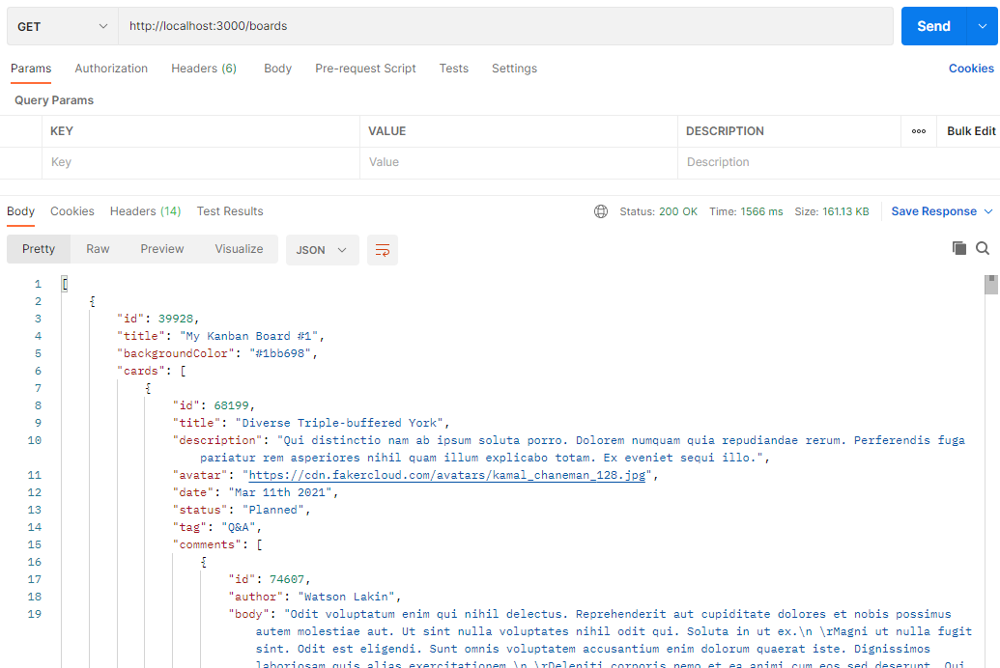
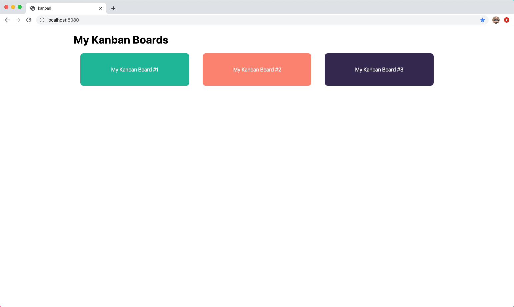
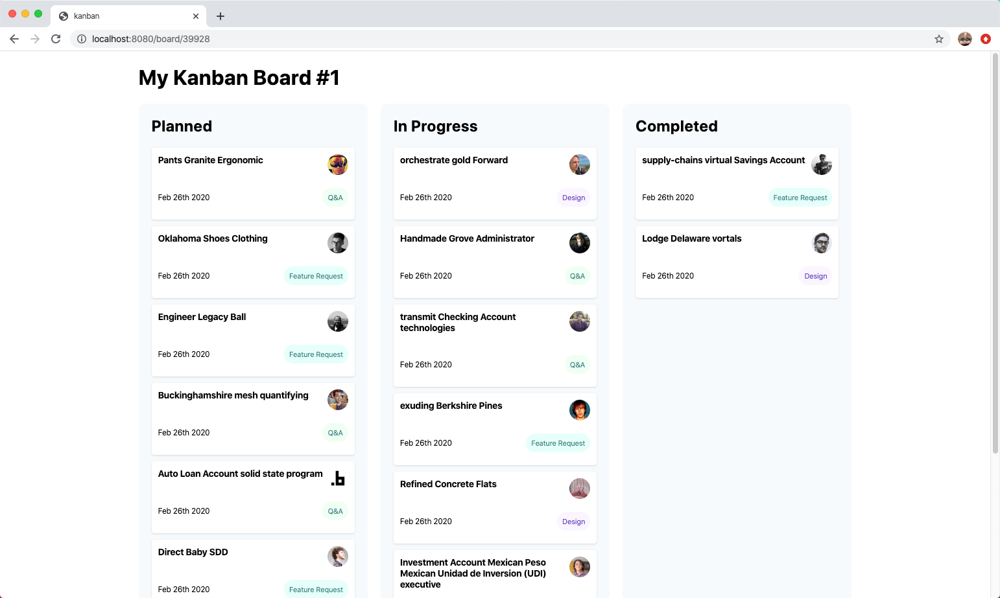
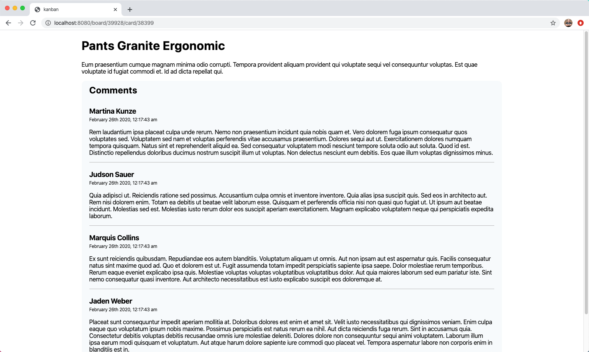
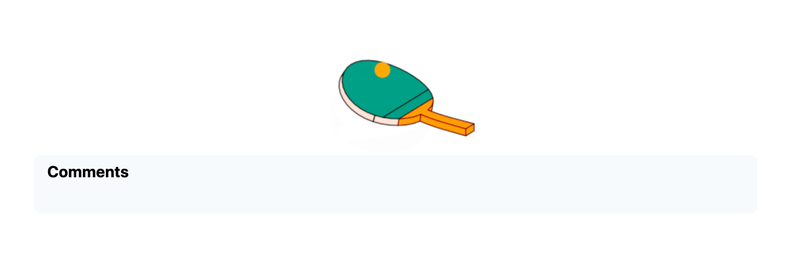

# Web Services (GET) Lecture Code Walkthrough

## Kanban board starting code

To run the application, use the command `npm run serve`. This starts both the local API and the Vue application:

```js
"scripts": {
  "serve": "npm-run-all --parallel json-server start",
  "start": "vue-cli-service serve",
  "json-server": "json-server ./db/kanban.json --delay 1000",
  ...
},
```

> Note: The local API returns JSON. This might be a good opportunity to discuss what JSON is and how it's used in JavaScript applications.

### Postman API

Before looking at the UI or code, get the students in the habit of exploring Web APIs using Postman. You can run the application using the starting code. There's an API available at http://localhost:3000/boards:



There are two endpoints that you'll work with:

- GET http://localhost:3000/boards
- GET http://localhost:3000/boards/:id

### Application UI

After you've had a chance to explore the API using Postman, walk through the UI of the existing application. When you visit http://localhost:8080/, you'll see a list of boards:



This is a great time to use the browser network tools to observe traffic between client and Web APIs, and review any questions on Request/Response or how the web works in general.

When you click on any board, you'll see a list of cards for that board:



When you click on a card, you'll see the details for that card along with any comments. This route works, but you won't see any data. This is the component that you'll build out during the lecture. For reference, this is what the card detail screen looks like:



### Application code

Now that you've had a chance to see what the application does, you'll take some time to discuss the code that makes it work.

#### Boards list

To see how the boards list works, start by looking at the router configuration. The `/` path loads `/src/views/Home.vue`:

```js
{
  path: '/',
  name: 'Home',
  component: Home
},
```

This imports and uses the `BoardsList/src/components/BoardsList.vue` component. There are several things that you can focus on here:

- Loading animation
- Importing `BoardsService.js`
- `created()` lifecycle hook
- `boardsService.getBoards()` service call

#### Cards list

To see how the cards list works, look at the router configuration. The `/board/:id` path loads `/src/views/Board.vue`:

```js
{
  path: '/board/:id',
  name: 'Board',
  component: Board
},
```

The Board view imports and uses the `CardsList/src/components/CardsList.vue` component. Make sure to discuss the following:

- Each column uses the `BoardColumn` component
- Each column's data uses a computed property to filter on status
- The `created()` lifecycle hook
- The `boardsService.getBoards()` service call

### Loading animation

The students might ask questions about the loading animation, so feel free to discuss this at any point. The first note to make is that the local API has a delay built into it. If there was no delay, it would come back quickly, and you wouldn't be able to show off the loading animation. That delay is controlled in the `json-server` script in `package.json`:

```js
"scripts": {
  "serve": "npm-run-all --parallel json-server start",
  "start": "vue-cli-service serve",
  "json-server": "json-server ./db/kanban.json --delay 1000",
  "generate": "json-server ./db/generator.js",
  "build": "vue-cli-service build",
  "lint": "vue-cli-service lint"
},
```

It's important to note that this isn't just a "nice to have" feature. It's best practice to let your visitors know that something is happening. If they only see a blank loading screen, they might think your application isn't working.

The way this works is by setting a data property on the component that fetches the data. By default, the `isLoading` property is set to `true`. As soon as you receive data from the API, you set `isLoading` to false:

```js
<script>
export default {
data() {
  return {
    boards: [],
    isLoading: true
  };
},
created() {
  boardsService.getBoards().then(response => {
    this.boards = response.data;
    this.isLoading = false;
  });
}
```

In the template, you display the animated ping-pong loader gif while the `isLoading` property is `true` and the content when it's `false`:

```html
<div class="loading" v-if="isLoading">
  
</div>
<div v-else>
  <!-- content -->
</div>
```

## Card detail component

If you click on a card from the `CardsList` component, you're taken to a URL that looks like `http://localhost:8080/board/39928/card/38399`. If you look at the router configuration, there is a route that matches that path. It loads `/src/views/Card.vue`:

```js
{
  path: '/board/:boardID/card/:cardID',
  name: 'Card',
  component: Card
}
```

The Card view imports and uses the `CardDetail /src/components/CardDetail.vue` component. This is the component you'll work in. Start by creating a card object that represents the details for this card:

```js
data() {
  return {
    card: {
      title: '',
      description: '',
      status: '',
      comments: []
    }
  };
},
```

Then display the title and description in the template:

```html
<template>
  <div>
    <h1>{{ card.title }}</h1>
    <p>{{ card.description }}</p>
  </div>
</template>
```

Next, you need to call the API to get the details for this service. Import the `BoardsService.js` and then use the `created()` lifecycle hook to call the `getCard()` method:

```js
import boardsService from '../services/BoardService';

export default {
  // ...
}
```

```js
created() {
  boardsService
    .getCard(this.$route.params.boardID, this.$route.params.cardID)
    .then(response => {
      this.card = response;
    });
}
```
Students may wonder why the Axios response data isn't accessed when `response` is assigned to `this.card`:

```js
.then(reponse => {
  this.card = response; //Axios response data is not accessed
});
```

To answer, take a moment to review `BoardService.js` with the students. Show them how `getCard()` uses `response.data` to get the list of cards from the Axios response, and then searches through the list to find the specific card desired. In other words, `getCard()` returns a specific card, and not an Axios response. Accessing the data in the Axios response is hidden in `getCard()`.

> Note: This is a great opportunity to dive into synchronous versus asynchronous programming.

If you run the application now, you'll be able to see the title and description for the card.

Next, you'll need to display the comments for this card. You could include the comments in the card detail component, but there may be times when you may want to separate cards and their comments. For instance, you may want to display a summary list of cards found after a text search. Each card would be displayed with its basic information. Users could ask for the comments on any card separately.

Based upon the potential need of displaying details and comments separately sometime in the future, students are provided with a starter `CommentsList` component. *For now, the details and comments are displayed together, but the code provides for a future need.*

Continue modifying the card detail component. Start by importing the `CommentsList` component, displaying it in the markup, and passing the `card.comments` as a prop:

```js
import CommentsList from '../components/CommentsList';

export default {
  name: 'card-detail',
  components: {
    CommentsList
  },
  // ...
}
```

```html
<comments-list v-bind:comments="card.comments" />
```

### Comments list

In the card detail component, you passed the comments as a prop. To accept the data in the comments list component, define a `comments` prop:

```js
export default {
  name: 'comments-list',
  props: ['comments']
};
```

With the comments prop defined, you can walk through the steps to display the comments:

```html
<template>
  <div class="comments">
    <h2>Comments</h2>
    <div class="comment" v-for="comment in comments" v-bind:key="comment.id">
      <h3>{{ comment.author }}</h3>
      <p class="postedOn">{{ comment.postedOn }}</p>
      <p>{{ comment.body }}</p>
    </div>
  </div>
</template>
```

### Data loading animation and back to board link

There are two things left to do in the card detail component. First, there's a loading animation for the boards and card list components. You'll need to add that feature to `CardDetail` as well. In `CardDetail`, add a new property called `isLoading` and default it to true:

```js
data() {
  return {
    card: {
      title: '',
      description: '',
      status: '',
      comments: []
    },
    isLoading: true
  };
}
```

In the template, add the following markup that displays the ping-pong loader as long as the `isLoading` property is true:

```html
<div class="loading" v-if="isLoading">
  
</div>
```

Because you used the `v-if` directive above, you can use the `v-else` directive on the `CommentsList` component:

```html
<comments-list v-bind:comments="card.comments" v-else />
```

> Note: Defer any discussion about the `v-else` directive on the `CommentsList` component with a promise that you'll discuss it once the last step below is completed, and the students have seen the finished page.

Finally, add a link so the user can go back to the board without using the Back button. After `<comments-list />`, add the following code. You can use this an opportunity to cover `<router-link />` and named routes once more. Also, you can show that you can use a `!` in the `v-if` attribute—meaning, only show the link if `isLoading` equals false:

```html
<div class="board-actions" v-if="!isLoading">
  <router-link
    v-bind:to="{ name: 'Board', params: { id: $route.params.boardID } }">
      Back to Board
  </router-link>
</div>
```

The `lecture-final` project contains the solutions for both `CardDetail` and `CommentsList`.

Now, fulfill your "promise", and show students what happens when the `v-else` directive is removed. While the server is still running, remove the directive, let the server refresh, and then select a card to display:

```html
    <comments-list v-bind:comments="card.comments" />
```

Because you've removed the directive, the `CommentsList` component always displays regardless of the "loading" state. Since the card is still loading, there are no comments yet, and all that shows is the "Comments" header.



Once the card is loaded, the page refreshes, and both card details and comments are displayed, so the visual blip is temporary, but still annoying. The `v-else` directive prevents the annoyance.
